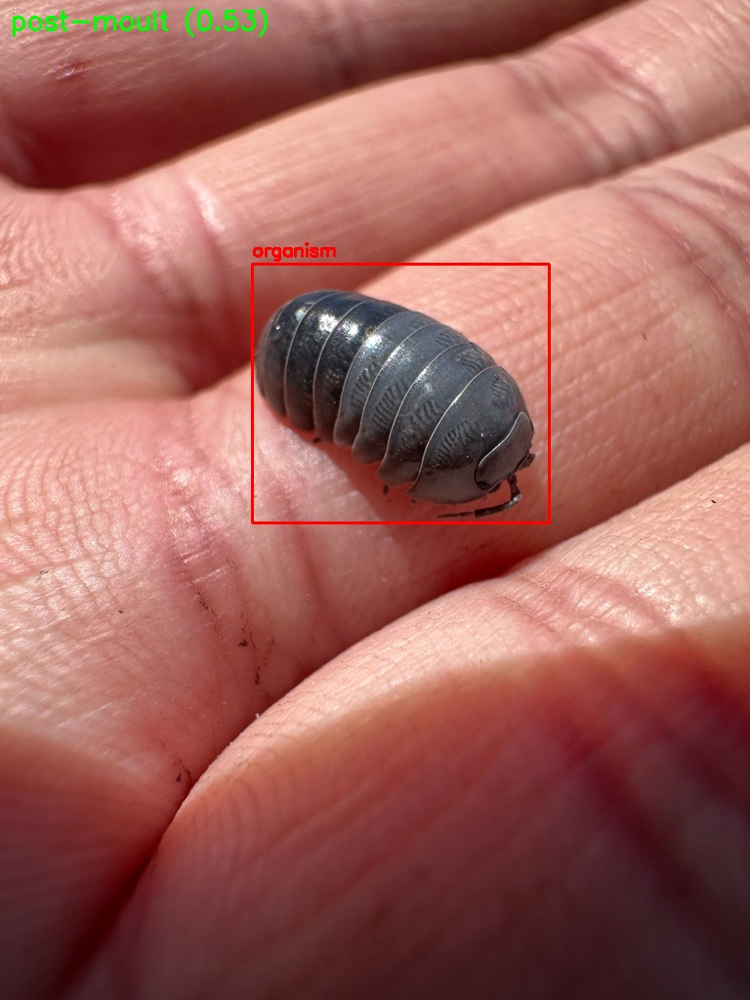
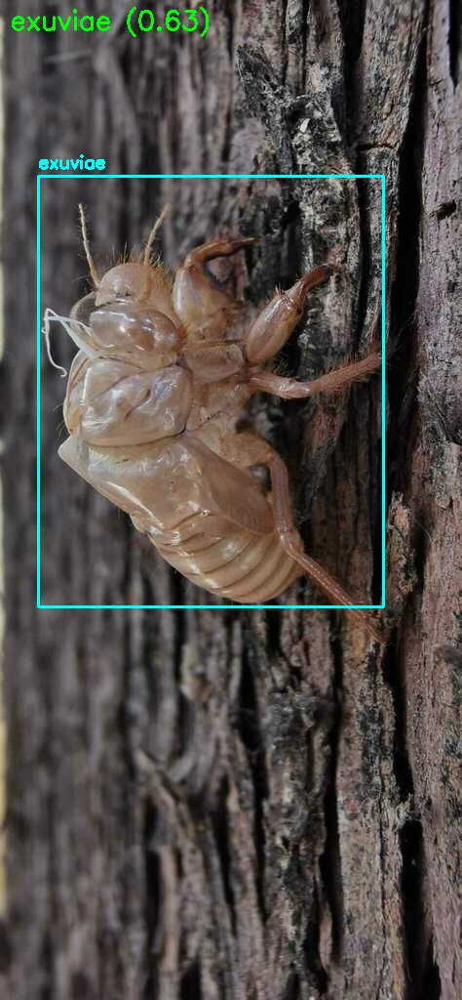
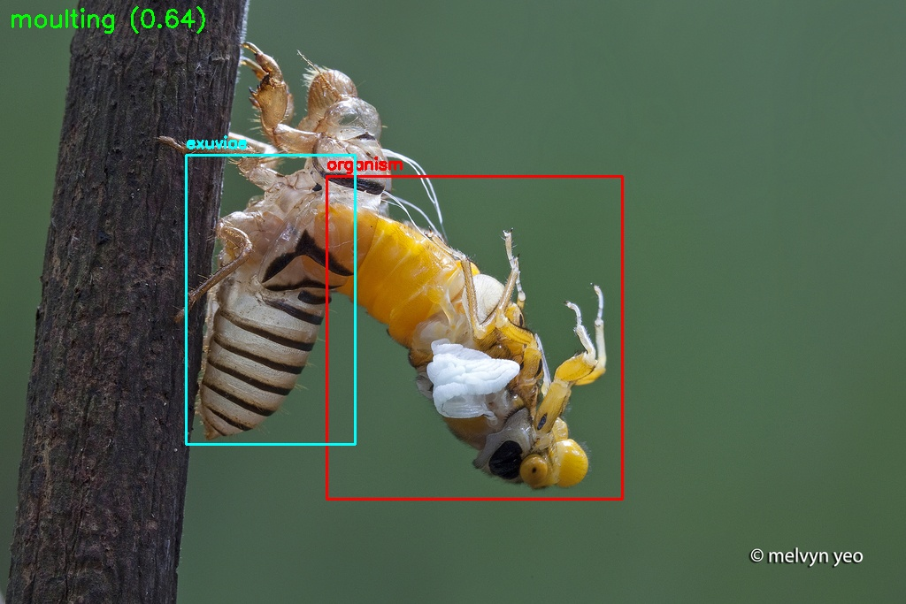

# 🐛 MoultGPT

**MoultGPT** is a modular NLP & CV pipeline for extracting biologically relevant traits related to moulting in arthropods from scientific literature and images. It combines full-text parsing, sentence-level summarization, trait extraction using a local LLM, and image-based stage classification using CNNs. The entire pipeline is accessible through an interactive React interface.

---

## 🚀 Features

- 🧠 Local inference using Mistral 7B (via HuggingFace Transformers)
- 📄 PDF parsing and TEI conversion using GROBID (CLI)
- 🔍 Sentence-level summarization with TF-IDF + clustering
- ✍️ YAML-style trait extraction using LLM
- 🖼️ Image-based stage prediction using EfficientNet CNNs
- 🌐 Frontend (React) + backend (Flask)

---

## ⚙️ Environment Setup

```bash
git clone https://github.com/MicheleRoar/MoultGPT.git
cd MoultGPT

# Python environment
python3 -m venv mistral_env
source mistral_env/bin/activate
pip install -r requirements.txt
```

---

## 🧠 Backend (Flask + LLM + CNN)

```bash
cd backend
python app.py
```

Ensure the following models are available:

- `mistral-7B-Instruct-v0.3` LLM (path configured in `app.py`)
- CNNs stored in `models/`:
  - `yolov8m.pt` — bounding box detector
  - `xgboost_stage.pkl` — stage classifier (from geometric features)

---

## 🖼️ CNN-based Image Classification (Highlight)

MoultGPT includes a robust pipeline for automatic classification of moulting stages from arthropod images.

### 🏗️ Pipeline Overview

1. **YOLOv8** detects bounding boxes for:
   - `organism`
   - `exuviae`
2. **Feature extraction**: spatial + color-based features computed from boxes
3. **XGBoost classifier** predicts moulting stage:
   - `pre-moult`, `moulting`, `post-moult`, `exuviae`

---

### 📸 Example Predictions

|  |  |  |
|:-------------------------------------------:|:--------------------------------------------------:|:----------------------------------:|
| post-moult (0.53)                           | exuviae (0.63)                                     | moulting (0.64)                   |

Bounding boxes are color-coded:
- 🟥 `organism`
- 🟦 `exuviae`
- 🟢 stage label and confidence

---

## 📬 Prediction API

Send a POST request to:

```
/predict_image
```

With:
- `image`: JPG or PNG image
- `taxon_id`: one of  
  `0 = Arachnida`, `1 = Crustacea`, `2 = Hexapoda`, `3 = Myriapoda`

Response:

```json
{
  "prediction": "moulting",
  "confidence": 0.64,
  "organism_bbox": [x, y, w, h],
  "exuviae_bbox": [x, y, w, h]
}
```

---

## 📚 Parsing PDFs with GROBID (CLI)

```bash
cd tools/grobid
./gradlew run
```

Used to convert scientific papers from PDF to structured TEI-XML, then plain text.

---

## 🧪 Fine-tuning (LoRA) for trait extraction

```bash
cd finetuning/modules
python main_generate_dataset.py
```

This generates YAML-style Q&A datasets from annotated PDFs (see `finetuning/file/MoultDB character annotations.xlsx`).

---

## 🌐 Frontend (React GUI)

```bash
cd frontend
npm install
npm start
```

Includes:
- ✅ PDF or `.txt` upload
- ✅ DOI input + TEI parsing
- ✅ Trait-specific queries (NLP)
- ✅ Image classification (CNN)
- ✅ YAML output + feedback

---

## 📁 Project Structure

```
MoultGPT/
├── backend/               # Flask server (LLM + CNN)
├── CNN/                   # Training scripts and models
├── frontend/              # React GUI
├── finetuning/            # LoRA generation scripts + Excel annotations
├── paper_handler/         # GROBID-based parsing
├── tools/grobid/          # GROBID CLI
├── data/                  # Annotated dataset + split config
├── models/                # Saved models (.pt, .pkl)
├── test/results/          # Example prediction images
└── requirements.txt
```

---

## 🧠 What’s Next

### 🧭 Directional Moulting Detection

We're developing a spatial reasoning module to infer **moulting direction** — cephalic, anterior, dorsal, posterior — directly from images.

This involves:
- Localizing suture lines and egress points with **pose estimation models** (*YOLOv8-pose*, *HRNet*)
- Estimating anatomical axes and emergence vectors
- Linking morphology to functional moulting strategies across taxa

🔬 **The goal**: infer movement, structure, and behaviour — from a single image.

---

## 🤝 Citation / Acknowledgements

This tool integrates:

- [Mistral-7B-Instruct-v0.3](https://huggingface.co/mistralai/Mistral-7B-Instruct-v0.3)
- [GROBID](https://github.com/kermitt2/grobid)
- [Ultralytics YOLOv8](https://github.com/ultralytics/ultralytics)
- [XGBoost](https://xgboost.readthedocs.io/)
- [PyTorch](https://pytorch.org/)
- [scikit-learn](https://scikit-learn.org/)

---

## 📬 Contact

Project lead: **Michele Leone**  
Email: [michele.leone@outlook.com]  
Website: [https://www.moulting.org](https://www.moulting.org)
