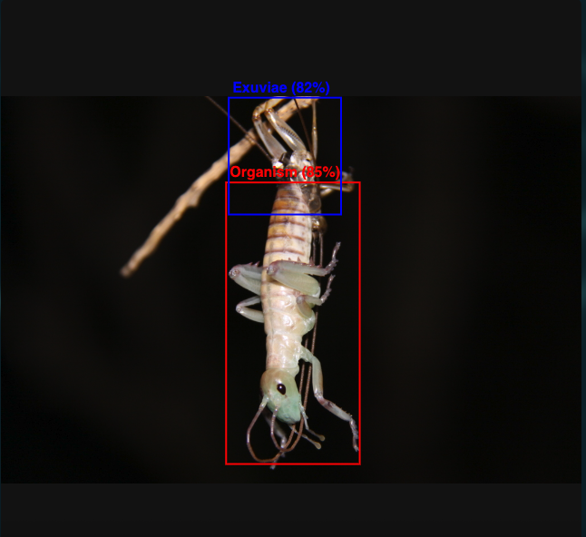
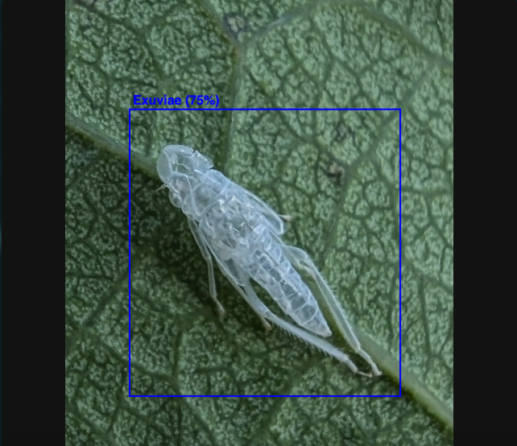
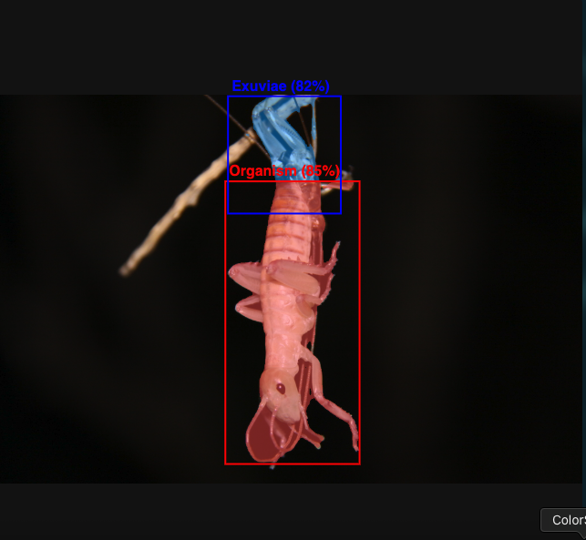
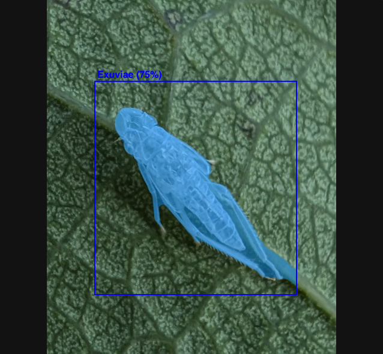
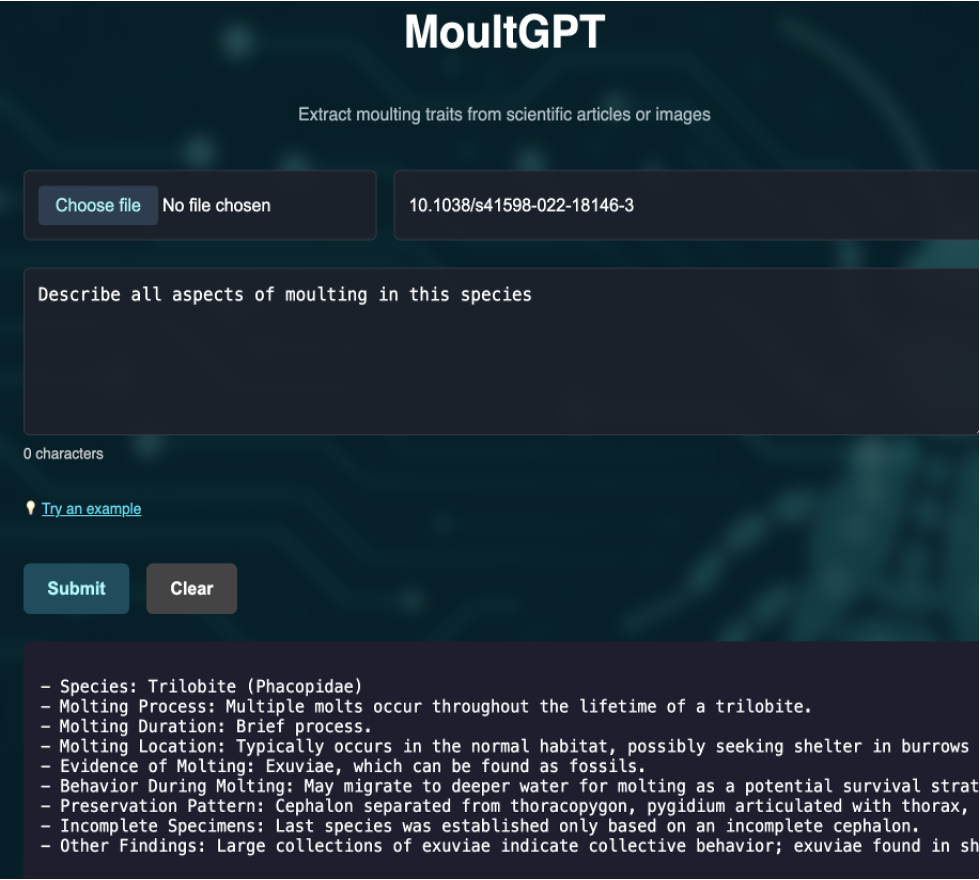
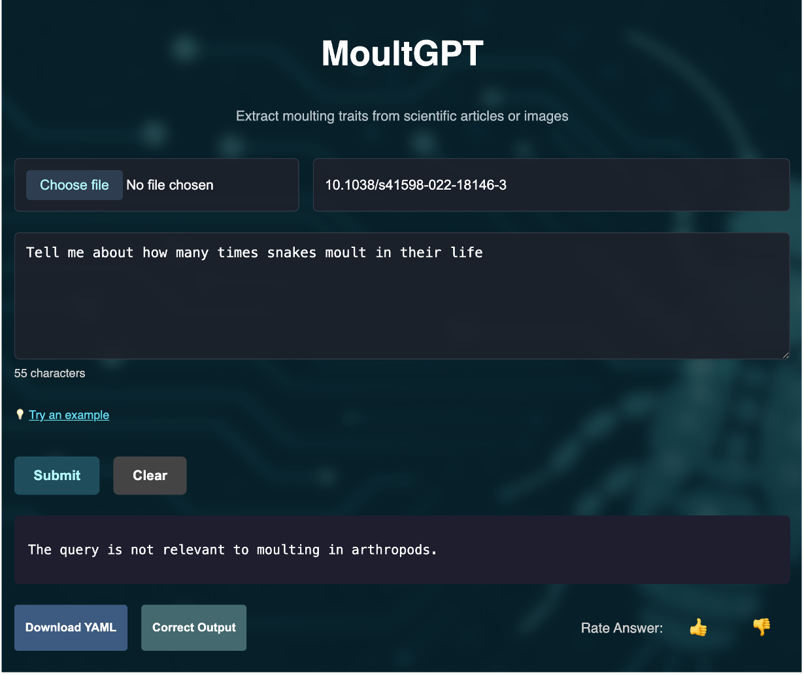

# 🐛 MoultGPT

**MoultGPT** is a dual text + vision system that extracts biologically meaningful moulting traits of arthropods from **scientific articles** and **images**, combining YOLO-based detection, segmentation masks, geometric feature extraction, and LLM-based trait extraction with strict domain gating.

The project is split into two main components:

- **Vision module (`vision/`)** – given an arthropod image, it:
  - detects organism and exuviae with a fine-tuned YOLO model,
  - builds segmentation masks,
  - extracts geometric / colour features,
  - predicts the moulting stage and related attributes.

- **LLM module (`llm/`)** – given a DOI, PDF, or plain text, it:
  - downloads the paper (via Unpaywall),
  - converts PDF → TEI XML → plain text (via GROBID),
  - selects sentences relevant to moulting,
  - checks that the paper + question are in scope (arthropod moulting only),
  - queries a local Mistral-7B model (optionally LoRA-finetuned) and returns *clean YAML* with trait values.

---

## 🖼️ Vision Module – Examples

### YOLO + stage classifier (3 examples)

|  |  |  |
|:----------------------------------:|:----------------------------------:|:----------------------------------:|
| moulting (0.82)                  | post-moult (0.75)                     | exuviae (0.67)                    |

---

### Segmentation overlays (3 examples)

|  |  |  |
|:------------------------------------------------------:|:-------------------------------------------------------:|:------------------------------------------------------:|
| organism + exuviae mask                                | organism-only mask                                       | exuviae-only mask                                     |

---

## 🧠 LLM Module – Examples

### ✅ Extraction of Moulting Traits (YAML Output)



---

### ❌ Out-of-scope Rejection
MoultGPT refuses vertebrate moulting questions and unrelated prompts.



---

### 🎯 Example gating behaviour

Given a paper clearly about arthropods (e.g. Cambrian euarthropods):

- ✅ “What moulting traits are reported for Hurdiidae and Kerygmachela in this paper?”  
- ✅ “Extract all information related to moulting of the species in this paper.”  
- ✅ “Summarise all moulting traits of the spider described in this paper.”  
- ❌ “How often do birds moult their feathers?” → rejected (vertebrates).  
- ❌ “Which species is described in this paper?” → rejected (not moulting-focused).  
- ❌ “What is the GDP of France?” → rejected (off-topic).

Given an economics paper with no arthropods and no moulting sentences:

- All moulting-related questions are rejected at the **paper gate** with:  
  *“The provided article does not seem to contain enough moulting-related content to answer questions reliably.”*

---

## 📦 Repository Structure

Only lightweight, GitHub-safe files are included.  
Heavy models, large datasets, logs, and PDFs are excluded.

```text
.
├── llm/
│   ├── backend/
│   │   ├── app.py                # Flask API (LLM backend, routing, gating, LLM call)
│   │   └── feedback/             # JSONL feedback for RLHF / evaluation
│   ├── pipeline/
│   │   ├── downloader.py         # DOI → PDF via Unpaywall
│   │   ├── parser.py             # PDF → TEI (GROBID) → text
│   │   ├── summarization.py      # extract_relevant_sentences(...)
│   │   ├── processor.py          # input_to_text(...), orchestration
│   │   └── gating.py             # analyze_paper_for_moulting, route_query_for_paper
│   ├── domain/
│   │   └── taxonomy_graph.py     # Arthropoda graph + name index
│   ├── data/
│   │   ├── arthropod_taxonomy.csv  # compact taxonomic dictionary extracted from moultdb.org
│   │   └── summaries/              # small text summaries (no full TEI/PDF)
│   └── finetuning/
│       └── modules/               # dataset generation / template helpers (code only)
│
├── vision/
│   ├── backend/
│   │   └── app.py                # Flask API for YOLO + features + stage classification
│   ├── data/
│   │   ├── yolo/                 # tiny YOLO sample dataset (images + labels)
│   │   └── inat_raw/             # small raw sample only (full dataset excluded)
│   ├── frontend/
│   │   └── src/                  # React interface (MoultVision)
│   ├── scripts/
│   │   ├── training/             # YOLO / XGBoost training utilities
│   │   └── yolo/                 # YOLO-specific helpers (e.g. split_dataset_yolo.py)
│   └── utility/
│       ├── annotation/           # bounding box / keypoint annotation tools
│       └── build_dataset.py      # generates features / splits from raw data
│
├── output/                    # example images used in the README
└── README.md
```

---

## 🔬 High-level Architecture

## 1. Vision / CNN–YOLO module (`vision/`)

> The vision pipeline is currently exposed as a separate demo (MoultVision), and is designed to be integrated with the LLM-based traits in a unified MoultGPT API.

1. **Object detection (YOLO)**
   - Fine-tuned YOLO model detects:
     - `organism` (living specimen),
     - `exuviae` (shed exoskeleton).
   - Produces bounding boxes with class labels and confidences.
   - Typical weights download:

     ```text
     YOLO detection (fine-tuned on arthropod moulting images):
     https://huggingface.co/MrRoar/arthropods_moulting_detection
     ```

2. **Segmentation masks**
   - From the bounding boxes, the pipeline generates a **mask channel** distinguishing:
     - organism region,
     - exuviae region,
     - background.
   - This mask can be concatenated with RGB as a 4th channel for CNN models, or used to derive geometric features.

      ```text
     FastSAM segmentation:
     https://github.com/ultralytics/assets/releases/download/v8.3.0/FastSAM-x.pt
     ```  

3. **Feature extraction & classification (XGBoost)**
   - Geometric features:
     - area, aspect ratio, distance between boxes, overlap, centroids, etc.
   - Intensity / colour statistics:
     - mean RGB / grayscale, contrasts, etc. per box.
   - `XGBoost` classifier predicts the moulting stage:
     - `pre-moult`
     - `moulting`
     - `post-moult`
     - `exuviae`

     ```text
     XGBoost stage classifier:
     https://huggingface.co/MrRoar/arthropods_moulting_stage
     ```

4. **Data generation**
   - The vision data used for YOLO and XGBoost is **self-generated** from iNaturalist images (only CC0, CC-BY, CC-BY-NC):
     - Raw images and metadata are processed by utility scripts (e.g. `vision/utility/build_dataset.py`).
     - The script constructs:
       - YOLO-style `images/` and `labels/` directories,
       - CSV feature tables for the XGBoost training pipeline.
   - Only **small subsets** and example files are kept in the public repo; large datasets are excluded.

5. **Rendering and frontend**
   - The Vision module React frontend:
     - Lets the user upload an image,
     - Sends it to the Flask vision backend,
     - Displays:
       - 🟥 organism box,
       - 🟦 exuviae box,
       - 🟢 predicted stage + confidence,
       - optional orientation cues (from pose models).

---

## 🧪 Vision Backend – How to Run

### 1. Requirements

- Python ≥ 3.10  
- `conda` or `venv` recommended  
- GPU optional (YOLO runs fine on CPU for demo purposes)

### 2. Create and activate environment

```bash
conda create -n moultgpt_vision python=3.10
conda activate moultgpt_vision
pip install -r vision/requirements.txt
```

### 3. Start the vision backend

```bash
cd vision/backend
python app.py
```

### 4. Start the vision frontend

```bash
cd vision/frontend
npm install
npm start
```

A React interface opens at http://localhost:3000, where you can upload an image and visualize:
- 🟥 organism box
- 🟦 exuviae box
- 🟢 predicted stage + confidence

---

## 2. Text / LLM module (`llm/`)

The LLM pipeline processes a DOI, local PDF, or raw text and extracts arthropod moulting traits using a Mistral-7B model (optionally LoRA-finetuned). It consists of:

1. **Acquisition & parsing**
   - DOI → PDF via Unpaywall  
   - PDF → TEI/XML → plain text via GROBID (CLI)

2. **Taxonomy graph & gating**
   - A precomputed **Arthropoda graph** (GBIF + NCBI + iNaturalist) encodes canonical names, synonyms and taxonomic paths.
   - The graph is used to detect arthropod taxa in the paper and map fuzzy names to their clades.
   - **Paper gate**: rejects papers without arthropods or without moulting content  
   - **Question gate**: rejects vertebrate moulting questions or off-topic prompts  
   - Ensures the system answers **only arthropod moulting** questions

3. **Sentence selection**
   - Sentence splitting → keyword filtering  
   - TF-IDF + K-Means to select ~20 diverse, moulting-relevant sentences  
   - Used as the context passed to the LLM

4. **LLM inference**
   - Builds a moulting-specialised prompt combining:
     - the selected sentence summary  
     - the user question  
   - Runs **Mistral-7B-Instruct-v0.3** (4-bit optional, LoRA optional)  
   - Produces **clean YAML only**, e.g.:

    ```yaml
    moulting_stage: post-moult
    taxa: [Hurdiidae, Kerygmachela]
    ecdysis_type: dorsal rupture
    egress_direction: anterior
    cuticle_state: hardened
    evidence: "Exuviae positioned behind the specimen; new cuticle rigid with no visible wrinkling."
    confidence: 0.92
    ```

5. **Feedback and fine-tuning**
   - `/feedback` endpoint
     - Stores per-query feedback in `llm/backend/feedback/feedback.jsonl`.
     - Designed for future RLHF and comparison between:
       - vanilla Mistral,
       - LoRA-fine-tuned Mistral,
       - alternative LLMs (e.g. LLaMA variants).
   - `llm/finetuning/`
     - Contains the dataset generator, templates, and modules used to create YAML QA pairs from annotated papers (no large `.jsonl` files kept in the public repo).

6. **Model downloads**

   Base model:

   - **Mistral-7B-Instruct-v0.3**  
     https://huggingface.co/mistralai/Mistral-7B-Instruct-v0.3

   Optional LoRA adapter (currently placeholder link):

   - **MoultGPT LoRA weights**  
     https://huggingface.co/placeholder/moultgpt-mistral-lora

---

## 🧪 LLM Backend – How to Run

### 1. Requirements

- Python ≥ 3.10  
- `conda` or `venv` recommended  
- Access to:
  - a local **GROBID** service (CLI or HTTP, typically `http://localhost:8070`),
  - a local copy of **Mistral-7B-Instruct-v0.3** (downloaded from Hugging Face).

### 2. Create and activate environment

```bash
conda create -n moultgpt_llm python=3.10
conda activate moultgpt_llm

pip install -r requirements.txt
```

### 3. Environment variables

Minimum:

```bash
export MODEL_PATH="/reference/LLMs/Mistral_AI/mistral-7B-Instruct-v0.3-hf/"
export PORT=5002
# Optional:
# export USE_LORA="true"
# export LORA_PATH="/path/to/lora/weights"
```

GROBID configuration (URL/port) is set inside `pipeline/parser.py`.

### 4. Start the LLM backend

From `llm/backend/`:

```bash
python app.py
```

The service exposes:

- `GET /` – health check  
- `POST /preprocess` – runs the pipeline up to summary + gating (no LLM)  
- `POST /query` – full pipeline including LLM call  
- `POST /feedback` – records feedback in JSONL  

---

## 📡 API Usage

### `POST /preprocess`

Debug endpoint, useful to inspect what the system sees before calling the LLM.

**Form fields (multipart/form-data):**

- `doi` (option 1) – article DOI   
- `file` (option 2) – uploaded PDF 
- `text` (optional) – plain text  

Priority: `doi` > `file` > `text`.

**Response example (JSON):**

```json
{
  "source": "doi",
  "full_text_chars": 36163,
  "full_text_preview": "Background: Extended parental care is a...",
  "summary": "Results: Here, we describe the post-embryonic growth of Fuxianhuia protensa...",
  "paper_taxa": [
    {
      "matched_name": "Fuxianhuia protensa",
      "taxon_id": 123,
      "path": "1.72.5.3",
      "top_group": "Mandibulata",
      "source": "gbif"
    }
  ],
  "n_summary": 20,
  "paper_has_arthropods": true,
  "paper_is_relevant": true
}
```

---

### `POST /query`

Main endpoint: returns YAML extracted by the LLM.

**Form fields (multipart/form-data):**

- `prompt` (**required**) – user question (e.g. *"What moulting traits are reported for Hurdiidae and Kerygmachela in this paper?"*)  
- `doi` (optional)  
- `file` (optional)  
- `text` (optional)  

Same priority: `doi` > `file` > `text`.

Out-of-scope example:

```json
{
  "error": "out_of_scope",
  "message": "The question appears to concern moulting in vertebrates (birds, mammals, reptiles, etc.). MoultGPT is restricted to moulting in arthropods.",
  "reason": "vertebrate_moulting_out_of_scope",
  "stage": "question_gate"
}
```

Successful example:

```json
{
  "response": "moulting_stage: post-moult
taxa:
  - Hurdiidae
  - Kerygmachela
evidence: "The exuviae was found fully detached behind the specimen..."
confidence: 0.87
",
  "latency_sec": 5.42,
  "routing_stage": "ok",
  "routing_reason": "generic_moulting_on_arthropod_paper",
  "paper_taxa": [...],
  "n_relevant_sentences": 20
}
```

`response` contains **YAML only**, suitable for direct parsing.

---

## 🔭 Roadmap

Planned work includes:

- **LoRA fine-tuning** of Mistral-7B on a curated YAML QA dataset of moulting traits.  
- **Benchmarking**:
  - Mistral vanilla vs. LoRA-fine-tuned Mistral vs. LLaMA variants.  
- **Full integration** of:
  - text traits (LLM) and  
  - image traits (YOLO + XGBoost / CNN)  
  into a single MoultGPT API and GUI.  
- **Containerisation / deployment**:
  - Docker images for the LLM backend and vision backend,  
  - Slurm scripts for running the stack on HPC.  

---

## 📚 References and Tools

- [Mistral-7B-Instruct-v0.3](https://huggingface.co/mistralai/Mistral-7B-Instruct-v0.3)  
- [GROBID](https://github.com/kermitt2/grobid)  
- [Unpaywall API](https://unpaywall.org/products/api)  
- [Ultralytics YOLO](https://github.com/ultralytics/ultralytics)  
- [XGBoost](https://xgboost.readthedocs.io/)  
- [PyTorch](https://pytorch.org/)  
- [scikit-learn](https://scikit-learn.org/)  

---

## 📬 Contact

Project lead: **Michele Leone**  
Email: micheleleone@outlook.com  
Website: https://www.moulting.org
